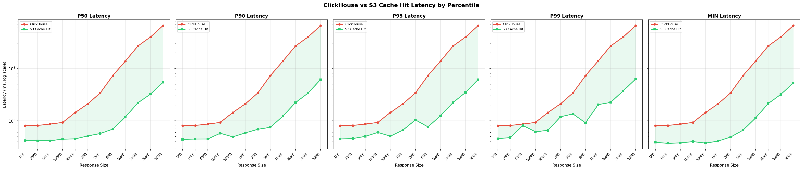
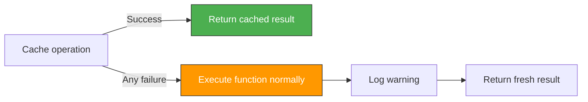
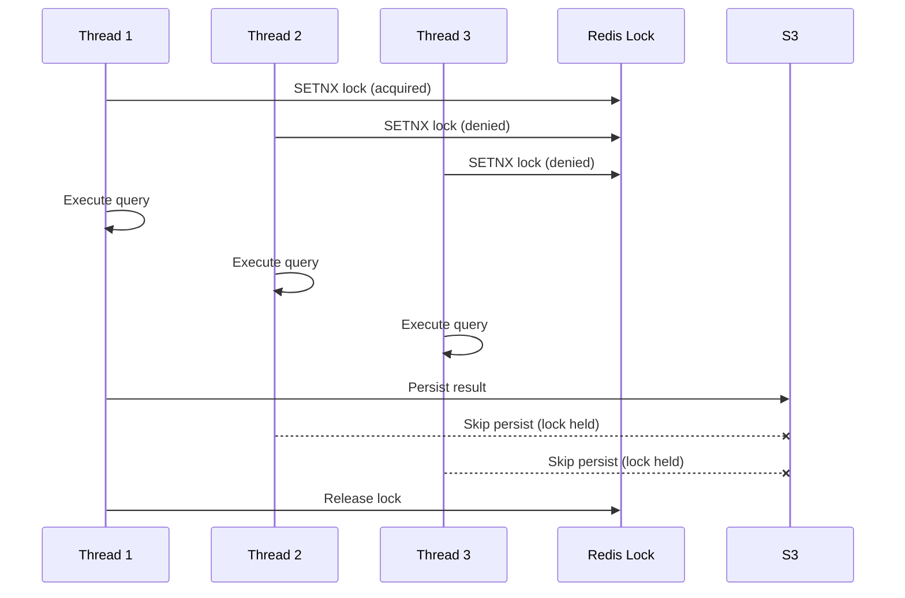

<p align="center">
  <h1 align="center">redis-s3-cache</h1>
  <p align="center">
    <strong>Drop-in caching for expensive queries. One decorator. Redis metadata. S3 storage. Zero latency overhead.</strong>
  </p>
  <p align="center">
    <a href="https://pypi.org/project/redis-s3-cache/"></a>
    <a href="https://pypi.org/project/redis-s3-cache/"></a>
    <a href="https://github.com/Pravin-Suthar/s3_based_redis_cache/blob/main/LICENSE"></a>
    <a href="https://github.com/Pravin-Suthar/s3_based_redis_cache/actions"></a>
  </p>
</p>

---

Your ClickHouse query takes 6 seconds. Your users hit it 200 times a day. That's 20 minutes of wasted compute **daily** — for the same result.

`redis-s3-cache` fixes that with one line:

```python
@cached(ttl=3600)
def run_query(query: str):
    return clickhouse.execute(query)
```

First call: 6 seconds (normal). Every call after: **~100ms** from S3. Background thread handles the caching — your function returns instantly, every time.

### Benchmarked: 75-92% faster at 500KB+



<sub>30 iterations per size | Runner: Azure Chicago → S3: us-east-1 Virginia | Cross-region (~1000km) — same-region would be even faster</sub>

---

## Table of Contents

- [Install](#install)
- [30-Second Integration](#30-second-integration)
- [How It Works](#how-it-works)
- [When Should You Use This?](#when-should-you-use-this)
- [When Should You NOT Use This?](#when-should-you-not-use-this)
- [Features Deep Dive](#features-deep-dive)
- [Integration Guide](#integration-guide)
- [Full API Reference](#full-api-reference)
- [Configuration](#configuration)
- [Benchmark Results](#benchmark-results)
- [Production Checklist](#production-checklist)
- [Troubleshooting](#troubleshooting)
- [FAQ](#faq)
- [Contributing](#contributing)

---

## Install

```bash
pip install redis-s3-cache
```

With pandas DataFrame support:

```bash
pip install redis-s3-cache[dataframe]
```

**Requirements:** Python 3.9+ | Redis server | AWS credentials (for S3)

---

## 30-Second Integration

**Step 1:** Initialize once at app startup.

```python
from s3cache import CacheManager

CacheManager.initialize(
    s3_bucket="my-cache-bucket",
    redis_url="redis://localhost:6379/0",
)
```

**Step 2:** Add `@cached` to any function.

```python
from s3cache import cached

@cached(ttl=3600)
def get_revenue_report(query: str):
    return db.execute(query)
```

**Step 3:** There is no step 3. You're done.

```python
# First call  → runs the function, caches result in background (6.2s)
result = get_revenue_report("SELECT sum(revenue) FROM orders GROUP BY month")

# Second call → served from S3 cache (91ms)
result = get_revenue_report("SELECT sum(revenue) FROM orders GROUP BY month")
```

---

## How It Works

```
 Your Code          redis-s3-cache                    Infrastructure
┌──────────┐       ┌──────────────┐                 ┌───────────────┐
│           │       │              │   metadata      │               │
│  @cached  │──────▶│  Decorator   │◀──────────────▶│     Redis     │
│  function │       │              │   (< 1ms)       │  (hash+TTL)   │
│           │       │              │                 │               │
└──────────┘       │              │   payload       ├───────────────┤
                    │              │◀──────────────▶│               │
                    │              │   (20-100ms)    │      S3       │
                    └──────────────┘                 │  (compressed) │
                                                     └───────────────┘
```

### Cache Miss (cold path)

```
1. @cached receives function call
2. Generate SHA-256 key from query + args
3. Check Redis → key not found (MISS)
4. Execute your function normally
5. Return result to caller immediately
6. Background thread: serialize → compress → upload to S3 → write Redis metadata
```

**Your function's latency is unchanged on a miss.** The caching happens after the return.

### Cache Hit (warm path)

```
1. @cached receives function call
2. Generate SHA-256 key from query + args
3. Check Redis → key found (HIT)
4. Read metadata: S3 path, format, compression
5. Download compressed payload from S3 (~30-100ms)
6. Decompress → deserialize → return
```

**Your function never executes.** Result comes straight from S3.

### What's stored where?

| Store | What | Size | TTL |
|---|---|---|---|
| **Redis** | Metadata only: S3 path, format, compression, timestamps | ~200 bytes per entry | Auto-expires |
| **S3** | Compressed serialized payload | The actual data | Cleaned up on eviction |

Redis stays lean. S3 handles the heavy lifting at $0.023/GB/month.

---

## When Should You Use This?

**YES — use it when:**

| Scenario | Why |
|---|---|
| BI dashboards hitting ClickHouse/Postgres with the same heavy queries | 5s query → 100ms cache hit, 50x faster |
| API endpoints returning large aggregated datasets | Reduce DB load, consistent response times |
| ETL pipelines re-running the same subqueries | Cache intermediate results, save compute |
| Multi-instance deployments | S3 + Redis are shared — all pods benefit |
| Expensive joins/aggregations on analytical databases | Cache the result, not the query plan |
| Reports that get pulled repeatedly | Generate once, serve from cache forever (until TTL) |

## When Should You NOT Use This?

**NO — don't use it when:**

| Scenario | Why | Use instead |
|---|---|---|
| Data changes every second | Cache will always be stale | No cache, or very short TTL |
| Queries return < 100KB | Your DB is already fast enough (~80ms) | Database is fine |
| Single-machine deployment with local Redis | S3 round-trip adds overhead | `functools.lru_cache` or Redis-only cache |
| You need real-time consistency | Cache introduces staleness by design | Direct DB reads |
| Results contain sensitive PII | S3 stores the data — audit your security | Encrypted cache or no cache |

---

## Features Deep Dive

### Fail-Open Design

Every cache operation is wrapped in try/except. **Your function always works**, even if the entire cache layer is on fire.



- Redis down? Function runs normally.
- S3 timeout? Function runs normally.
- Serialization error? Function runs normally.
- Everything logged via Python `logging` — nothing silently swallowed.

### Stampede Protection

10 threads hit the same cold query simultaneously. Without protection, all 10 serialize and upload to S3 — wasting bandwidth and money.

With `redis-s3-cache`, only **one** thread writes to S3:



All threads get results. Only one does the S3 write. Lock auto-expires after `stampede_lock_ttl` seconds (default: 30s) as a safety net.

### Smart Serialization

The library auto-detects the best format for your data:

| Return Type | Detected Format | Engine | Why |
|---|---|---|---|
| `pandas.DataFrame` | Parquet | PyArrow | Columnar, compressed, type-safe |
| `dict`, `list`, any Python object | Pickle | stdlib | Universal, fast |
| Override: `format="json"` | JSON | stdlib | Human-readable, interoperable |

```python
# Auto-detected: DataFrame → Parquet
@cached(ttl=3600)
def get_dataframe(query: str):
    return pd.read_sql(query, conn)  # → cached as Parquet

# Auto-detected: dict → Pickle
@cached(ttl=3600)
def get_stats(query: str):
    return {"count": 42, "avg": 3.14}  # → cached as Pickle

# Forced: JSON
@cached(ttl=3600, format="json")
def get_config(query: str):
    return {"feature_flags": ["a", "b"]}  # → cached as JSON
```

### Compression

All payloads are compressed before upload. Default is Zstandard — best speed-to-ratio tradeoff:

| Method | Config Value | Speed | Ratio | Best For |
|---|---|---|---|---|
| **Zstandard** | `"zstd"` (default) | Fast | ~50% reduction | Everything (recommended) |
| Gzip | `"gzip"` | Medium | ~45% reduction | Legacy systems |
| None | `"none"` | Instant | No reduction | Already compressed data |

A 10MB query result compresses to ~5MB with zstd. That's half the S3 storage cost and half the download time.

### Async Background Persistence

Cache writes **never** slow down your function:

```
Without redis-s3-cache:
  Function runs (6.2s) → return result
  Total: 6.2s

With redis-s3-cache (miss):
  Function runs (6.2s) → return result → [background: serialize + compress + S3 upload]
  Total: 6.2s (background work is invisible)

With redis-s3-cache (hit):
  S3 download + decompress (91ms) → return result
  Total: 91ms
```

Background persistence runs in a daemon thread. If your process exits, the thread dies cleanly — no zombie processes, no data corruption (S3 PUTs are atomic).

### Cache Key Generation

Keys are generated from a SHA-256 hash of:
- Normalized query string (whitespace-collapsed)
- All positional arguments
- All keyword arguments (sorted)
- Optional namespace

```
"SELECT  *  FROM  Users"  →  same key as  →  "SELECT * FROM Users"
                                               (whitespace normalized)

"select * FROM users"     →  different key  (case-sensitive)

run_query("SELECT 1", limit=10)  →  different key than  →  run_query("SELECT 1", limit=20)
                                                            (args included in hash)
```

### Eviction

Four strategies, working together:

| Strategy | Trigger | What Happens |
|---|---|---|
| **TTL** | Automatic | Redis key expires → next read is a miss → S3 object becomes orphan |
| **LRU** | `max_cache_entries` exceeded | Oldest entries (by `created_at`) deleted from Redis + S3 |
| **Manual** | Your code calls `invalidate()` | Specific entry or entire namespace wiped |
| **Orphan Cleanup** | Your code calls `cleanup_orphaned_objects()` | S3 objects with no Redis key deleted |

```python
cache = CacheManager.get()

# Evict one entry
cache.invalidate(query_hash)

# Evict everything in a namespace
cache.invalidate_namespace("analytics")

# Nuclear option
cache.clear()

# Garbage collection — find S3 objects that Redis forgot about
deleted = cache.cleanup_orphaned_objects()
print(f"Cleaned up {deleted} orphaned S3 objects")
```

### Observability

Built-in thread-safe stats tracker:

```python
cache = CacheManager.get()
stats = cache.stats()
```

```json
{
    "hits": 1234,
    "misses": 56,
    "errors": 2,
    "hit_rate": 0.956,
    "avg_hit_latency_ms": 45.2,
    "avg_miss_latency_ms": 1200.0
}
```

Wire this into your monitoring — Prometheus, Datadog, CloudWatch, whatever. The dict is ready to export.

---

## Integration Guide

### Flask

```python
# app.py
from flask import Flask
from s3cache import CacheManager, cached

app = Flask(__name__)

CacheManager.initialize(
    s3_bucket="my-cache-bucket",
    redis_url="redis://localhost:6379/0",
    default_ttl=3600,
)

@cached(ttl=1800, namespace="api")
def fetch_dashboard_data(query: str):
    return clickhouse.execute(query)

@app.route("/dashboard")
def dashboard():
    data = fetch_dashboard_data("SELECT * FROM metrics WHERE date > today() - 30")
    return jsonify(data)
```

### FastAPI

```python
# main.py
from contextlib import asynccontextmanager
from fastapi import FastAPI
from s3cache import CacheManager, cached

@asynccontextmanager
async def lifespan(app: FastAPI):
    CacheManager.initialize(
        s3_bucket="my-cache-bucket",
        redis_url="redis://prod-redis:6379/0",
        default_ttl=3600,
    )
    yield
    CacheManager.reset()

app = FastAPI(lifespan=lifespan)

@cached(ttl=1800, namespace="reports")
def get_revenue_report(query: str, year: int):
    return db.execute(query, year)

@app.get("/reports/revenue/{year}")
async def revenue(year: int):
    # Note: the cached function itself is sync — runs in threadpool
    return get_revenue_report("SELECT * FROM revenue WHERE year = %s", year)
```

### Django

```python
# settings.py or apps.py (AppConfig.ready)
from s3cache import CacheManager

CacheManager.initialize(
    s3_bucket="my-cache-bucket",
    redis_url="redis://localhost:6379/0",
)
```

```python
# views.py
from s3cache import cached

@cached(ttl=3600, namespace="reports")
def expensive_report(query: str, department: str):
    return ClickHouseClient().execute(query, {"dept": department})

def report_view(request, department):
    data = expensive_report(
        "SELECT * FROM reports WHERE dept = %(dept)s",
        department,
    )
    return JsonResponse(data, safe=False)
```

### Celery / Background Workers

```python
from s3cache import CacheManager, cached

# Initialize in worker startup
CacheManager.initialize(
    s3_bucket="my-cache-bucket",
    redis_url="redis://prod-redis:6379/0",
)

@cached(ttl=7200, namespace="etl")
def fetch_source_data(query: str, date: str):
    return warehouse.execute(query, date)

@celery_app.task
def run_etl_pipeline(date: str):
    # Multiple tasks can share cached results
    users = fetch_source_data("SELECT * FROM users WHERE date = %s", date)
    orders = fetch_source_data("SELECT * FROM orders WHERE date = %s", date)
    return transform(users, orders)
```

### With Namespaces (Targeted Invalidation)

```python
# Tag related queries with namespaces
@cached(ttl=3600, namespace="user_analytics")
def user_metrics(query: str, user_id: int):
    return db.execute(query, user_id)

@cached(ttl=3600, namespace="financial")
def revenue_data(query: str, quarter: str):
    return db.execute(query, quarter)

# When user data changes → invalidate only user analytics
CacheManager.get().invalidate_namespace("user_analytics")
# financial cache remains untouched
```

### DataFrame Caching (Pandas)

```python
pip install redis-s3-cache[dataframe]
```

```python
import pandas as pd
from s3cache import cached

@cached(ttl=7200)
def load_training_data(query: str):
    return pd.read_sql(query, connection)

# Automatically detected as DataFrame → serialized as Parquet
# Parquet preserves dtypes, column names, and indexes
df = load_training_data("SELECT * FROM features WHERE date > '2024-01-01'")
print(type(df))  # <class 'pandas.core.frame.DataFrame'>
```

### Local Development (No AWS needed)

```python
import os

if os.getenv("ENV") == "production":
    CacheManager.initialize(
        s3_bucket="prod-cache-bucket",
        redis_url="redis://prod-redis:6379/0",
    )
else:
    # Local disk instead of S3 — no AWS credentials needed
    CacheManager.initialize(
        storage_backend="local",
        local_path="./tmp/cache",
        redis_url="redis://localhost:6379/0",
    )
```

### Testing

```python
import pytest
import fakeredis
from s3cache import CacheManager
from s3cache.storage.local import LocalDiskBackend

@pytest.fixture(autouse=True)
def cache_manager(tmp_path):
    cache = CacheManager.initialize(
        _redis_client=fakeredis.FakeRedis(),
        _storage=LocalDiskBackend(str(tmp_path / "cache")),
        default_ttl=60,
    )
    cache._sync_mode = True  # Synchronous — no background threads in tests
    yield cache
    CacheManager.reset()

def test_cache_hit(cache_manager):
    @cached(ttl=60)
    def my_func(query: str):
        return {"data": 42}

    result1 = my_func("SELECT 1")  # MISS
    result2 = my_func("SELECT 1")  # HIT

    assert result1 == result2
    assert cache_manager.stats()["hits"] == 1
    assert cache_manager.stats()["misses"] == 1
```

### Custom Storage Backend

```python
from s3cache import StorageBackend, CacheManager

class GCSBackend(StorageBackend):
    """Google Cloud Storage backend."""

    def __init__(self, bucket: str, prefix: str = "cache"):
        from google.cloud import storage
        self._client = storage.Client()
        self._bucket = self._client.bucket(bucket)
        self._prefix = prefix

    def get(self, key: str) -> bytes | None:
        blob = self._bucket.blob(f"{self._prefix}/{key}")
        if not blob.exists():
            return None
        return blob.download_as_bytes()

    def put(self, key: str, data: bytes) -> None:
        blob = self._bucket.blob(f"{self._prefix}/{key}")
        blob.upload_from_string(data)

    def delete(self, key: str) -> None:
        blob = self._bucket.blob(f"{self._prefix}/{key}")
        if blob.exists():
            blob.delete()

    def list_keys(self, prefix: str = "") -> list[str]:
        blobs = self._bucket.list_blobs(prefix=f"{self._prefix}/{prefix}")
        return [b.name[len(self._prefix) + 1:] for b in blobs]

# Use it
CacheManager.initialize(
    redis_url="redis://localhost:6379/0",
    _storage=GCSBackend(bucket="my-gcs-bucket"),
)
```

---

## Full API Reference

### `@cached(ttl=None, namespace=None, format=None)`

Decorator that caches function results.

```python
@cached(ttl=3600, namespace="analytics", format="json")
def my_function(query: str, *args, **kwargs):
    ...
```

| Parameter | Type | Default | Description |
|---|---|---|---|
| `ttl` | `int \| None` | `None` | Cache TTL in seconds. `None` = use `default_ttl` from config |
| `namespace` | `str \| None` | `None` | Namespace for bulk invalidation |
| `format` | `str \| None` | `None` | Force serialization: `"pickle"`, `"json"`, `"parquet"` |

**Cache key is generated from:** first positional arg (query) + all args + all kwargs + namespace.

**Returns:** The original function's return value (cached or fresh).

---

### `CacheManager.initialize(**kwargs) → CacheManager`

Initialize the singleton. Call **once** at application startup.

```python
cache = CacheManager.initialize(
    s3_bucket="my-bucket",
    redis_url="redis://localhost:6379/0",
    default_ttl=3600,
    compression="zstd",
)
```

See [Configuration](#configuration) for all parameters.

---

### `CacheManager.get() → CacheManager`

Get the initialized singleton. Raises `RuntimeError` if not initialized.

```python
cache = CacheManager.get()
```

---

### `CacheManager.reset() → None`

Reset the singleton. Use in test teardown.

---

### `cache.get_cached(query_hash) → tuple[bool, Any]`

Manual cache lookup.

```python
hit, result = cache.get_cached("a1b2c3d4...")
if hit:
    print(f"Cache hit: {result}")
```

---

### `cache.persist_async(query_hash, result, ttl, namespace, fmt=None) → None`

Manual cache write (background thread).

```python
cache.persist_async("a1b2c3d4...", my_data, ttl=3600, namespace="reports")
```

---

### `cache.invalidate(query_hash) → None`

Delete one cache entry (Redis metadata + S3 object).

```python
from s3cache.key import make_cache_key
key = make_cache_key("SELECT * FROM users", (), {})
cache.invalidate(key)
```

---

### `cache.invalidate_namespace(namespace) → None`

Delete all entries in a namespace.

```python
cache.invalidate_namespace("analytics")  # Wipe all analytics cache
```

---

### `cache.clear() → None`

Delete **everything** — all Redis keys and all S3 objects under the prefix.

---

### `cache.stats() → dict`

Thread-safe cache statistics.

```python
{
    "hits": 1234,         # Successful cache reads
    "misses": 56,         # Cache read misses
    "errors": 2,          # Any cache operation failure
    "hit_rate": 0.956,    # hits / (hits + misses)
    "avg_hit_latency_ms": 45.2,   # Mean time to serve from cache
    "avg_miss_latency_ms": 1200.0  # Mean time including function execution
}
```

---

### `cache.cleanup_orphaned_objects() → int`

Find and delete S3 objects with no matching Redis key. Returns count deleted.

```python
deleted = cache.cleanup_orphaned_objects()
# Run this periodically (e.g., daily cron) to keep S3 clean
```

---

### `cache.acquire_stampede_lock(query_hash) → bool`

Manually acquire a stampede lock. Returns `True` if acquired.

### `cache.release_stampede_lock(query_hash) → None`

Release a stampede lock.

---

### `make_cache_key(query, args, kwargs, namespace=None) → str`

Generate a cache key manually.

```python
from s3cache.key import make_cache_key

key = make_cache_key(
    "SELECT * FROM users WHERE active = true",
    (42,),
    {"limit": 100},
    namespace="analytics",
)
# → "e3b0c44298fc1c149afb..." (64-char SHA-256 hex)
```

---

### Storage Backends

All backends implement the `StorageBackend` ABC:

```python
from s3cache import StorageBackend

class StorageBackend(ABC):
    def get(self, key: str) -> bytes | None: ...
    def put(self, key: str, data: bytes) -> None: ...
    def delete(self, key: str) -> None: ...
    def list_keys(self, prefix: str = "") -> list[str]: ...
```

**Built-in backends:**

| Backend | Import | Use Case |
|---|---|---|
| `S3Backend` | `from s3cache import S3Backend` | Production (multi-instance) |
| `LocalDiskBackend` | `from s3cache import LocalDiskBackend` | Development / testing |

```python
# S3
S3Backend(bucket="my-bucket", prefix="cache", region="us-east-1", client=None)

# Local disk (atomic writes via tmp + os.replace)
LocalDiskBackend(base_dir="/tmp/cache")
```

---

## Configuration

### All Parameters

```python
CacheManager.initialize(
    # ── S3 ──
    s3_bucket="my-bucket",             # Required for S3 backend
    s3_prefix="query-cache",           # S3 key prefix (default: "query-cache")
    aws_region="us-east-1",            # AWS region (default: "us-east-1")

    # ── Redis ──
    redis_url="redis://host:6379/0",   # Redis connection URL
    redis_key_prefix="qc:",            # Prefix for all Redis keys (default: "qc:")

    # ── Cache Behavior ──
    default_ttl=3600,                  # Default TTL in seconds (default: 1 hour)
    max_cache_entries=10000,           # LRU eviction threshold (default: 10000)

    # ── Serialization ──
    serialization_format="auto",       # "auto" | "pickle" | "json" | "parquet"
    compression="zstd",                # "zstd" | "gzip" | "none"

    # ── Concurrency ──
    stampede_lock_ttl=30,              # Lock timeout in seconds (default: 30)

    # ── Storage Backend ──
    storage_backend="s3",              # "s3" | "local"
    local_path="/tmp/query_cache",     # Path for local backend

    # ── Testing (dependency injection) ──
    _redis_client=None,                # Inject a pre-configured Redis client
    _storage=None,                     # Inject a pre-configured storage backend
)
```

### Environment-Based Configuration

```python
import os
from s3cache import CacheManager

CacheManager.initialize(
    s3_bucket=os.environ["CACHE_S3_BUCKET"],
    redis_url=os.environ.get("CACHE_REDIS_URL", "redis://localhost:6379/0"),
    default_ttl=int(os.environ.get("CACHE_TTL", "3600")),
    compression=os.environ.get("CACHE_COMPRESSION", "zstd"),
    max_cache_entries=int(os.environ.get("CACHE_MAX_ENTRIES", "10000")),
)
```

### Redis Metadata Schema

Each cache entry stores a Redis HASH at key `{prefix}{sha256_hash}`:

| Field | Type | Example | Description |
|---|---|---|---|
| `s3_path` | string | `"a1b2c3.pickle"` | S3 object key (relative) |
| `format` | string | `"pickle"` | Serialization format |
| `compression` | string | `"zstd"` | Compression method |
| `created_at` | string | `"1710520800"` | Unix timestamp |
| `ttl` | string | `"3600"` | TTL in seconds |
| `size_bytes` | string | `"524288"` | Compressed payload size |
| `namespace` | string | `"analytics"` | Optional namespace |

---

## Benchmark Results

> Full raw data: [`benchmark_results.csv`](benchmark_results.csv) (360 rows) | Percentile plots: [`benchmark_plot.png`](benchmark_plot.png)

### Test Environment

| Component | Detail |
|---|---|
| **Runner** | GitHub Actions (Azure), Chicago, Illinois (`AS8075 Microsoft Corporation`) |
| **S3 Bucket** | Standard tier, `us-east-1` (N. Virginia) |
| **Cross-region hop** | Chicago → N. Virginia (~1000km, ~12ms network RTT) |
| **Redis** | Sidecar container on the runner (localhost, ~0.1ms) |
| **Iterations** | 30 per size, 12 sizes (360 total data points) |

**Important:** The runner and bucket are in **different regions** (Chicago vs Virginia). In production, if your app and S3 bucket are in the **same region** (e.g., both `us-east-1`), expect cache hit latency to be **30-50% lower** than these numbers.

### How We Modeled ClickHouse Latency

Real ClickHouse queries weren't used — latency is simulated with a linear model based on observed production ClickHouse performance on MergeTree tables (100M-1B rows, LAN/cross-AZ networking):

```
ClickHouse latency = 80ms + 130ms × result_size_in_MB
```

| Component | Estimate |
|---|---|
| Query parse + plan | ~10ms (constant) |
| Column scan (compressed) | ~50ms base |
| Aggregation / merge | ~20ms base, scales with rows |
| Result serialization | ~50ms/MB (row → JSON/Native format) |
| Network transfer | ~80ms/MB (cross-AZ, app ↔ ClickHouse) |

This gives: 1KB → 80ms, 1MB → 210ms, 10MB → 1.38s, 50MB → 6.58s. Your actual ClickHouse latency may be higher (complex joins, cold reads) or lower (hot data, colocated). **The cache benefit scales with your real query time** — the slower your DB, the bigger the win.

### Latency Comparison

| Response Size | ClickHouse (simulated) | Cache Hit (avg) | Cache Hit (p95) | Speedup |
|---|---|---|---|---|
| 1KB | 80ms | 42ms | 45ms | **48%** |
| 10KB | 81ms | 42ms | 46ms | **49%** |
| 50KB | 86ms | 43ms | 50ms | **50%** |
| 100KB | 93ms | 45ms | 60ms | **52%** |
| 500KB | 144ms | 46ms | 51ms | **68%** |
| 1MB | 210ms | 53ms | 66ms | **75%** |
| 2MB | 340ms | 60ms | 104ms | **82%** |
| 5MB | 730ms | 71ms | 76ms | **90%** |
| 10MB | 1.38s | 120ms | 124ms | **91%** |
| 20MB | 2.68s | 219ms | 222ms | **92%** |
| 30MB | 3.98s | 325ms | 347ms | **92%** |
| 50MB | 6.58s | 556ms | 612ms | **92%** |

### The S3 Download Floor

S3 has a **minimum HTTP round-trip latency of ~42ms** in this benchmark (runner in Chicago → S3 in Virginia). This is the floor — no matter how small the payload, you pay this.

In a **same-region deployment** (app + S3 both in `us-east-1`), this floor drops to **~20-30ms**. On S3 Express One Zone, it can go as low as **single-digit ms**.

### Where the Cache Wins

```
Response Size →
                  1KB    100KB    500KB     1MB      5MB     10MB     50MB
                   │       │        │        │        │        │        │
  ClickHouse:     80ms    93ms    144ms    210ms    730ms   1.38s    6.58s
  Cache Hit:      42ms    45ms     46ms     53ms     71ms   120ms    556ms
                   │       │        │        │        │        │        │
  Verdict:       WIN     WIN      WIN      WIN      WIN     WIN      WIN
```

With the runner in a different region than the bucket, the cache **still wins at every size**. In a same-region setup, the margins get even wider.

### Percentile Distribution


The plot shows p50, p90, p95, p99, and min latencies across all sizes. Key observations:
- Cache hit latency is **flat and predictable** up to ~5MB (dominated by S3 round-trip floor)
- ClickHouse latency grows **linearly** with result size
- At p99, the cache shows occasional S3 tail latency spikes — still faster than ClickHouse above 500KB

### Recommendation

| Result Size | Recommendation |
|---|---|
| < 100KB | Cache if query is repeated frequently — 50% speedup even here |
| 100KB - 500KB | Cache for moderate wins (~50-68%) |
| 500KB+ | **Cache aggressively.** 75-92% speedup. This is the sweet spot. |

---

## Production Checklist

Before deploying to production, verify:

### Infrastructure
- [ ] **S3 bucket exists** in your target region
- [ ] **IAM permissions** granted: `s3:GetObject`, `s3:PutObject`, `s3:DeleteObject`, `s3:ListBucket`
- [ ] **S3 bucket policy** restricts access to your application role
- [ ] **Redis** is accessible from your application with sufficient memory
- [ ] **S3 lifecycle rule** (optional): auto-delete objects older than 2x your max TTL as a safety net

### Application
- [ ] `CacheManager.initialize()` called **once** at startup (not per-request)
- [ ] **TTLs** set appropriately per use case (don't cache stale data too long)
- [ ] **Namespaces** used for logical grouping (makes invalidation easier)
- [ ] **`max_cache_entries`** set based on your expected cache size
- [ ] **Error logging** configured — cache failures are logged as warnings

### Monitoring
- [ ] `cache.stats()` exported to your monitoring system
- [ ] Alert on `hit_rate` dropping below expected threshold
- [ ] Alert on `errors` count spiking
- [ ] Periodic `cleanup_orphaned_objects()` scheduled (e.g., daily cron)

### Security
- [ ] S3 bucket has **server-side encryption** enabled (AES-256 is used by default on uploads)
- [ ] Redis connection uses **TLS** if going over public network (`rediss://` URL scheme)
- [ ] No sensitive PII cached without proper access controls on the S3 bucket
- [ ] `redis_key_prefix` is unique per environment (don't share between staging/prod)

---

## Troubleshooting

### Cache hit rate is 0%

**Symptom:** `cache.stats()` shows all misses, no hits.

**Check:**
1. Is the TTL too short? If your TTL < time between repeated calls, you'll never hit.
2. Are the function arguments identical? Different args = different cache key.
3. Is Redis accessible? Check `cache.redis.ping()`.

### S3 upload errors in logs

**Symptom:** `Cache persist failed` warnings in logs.

**Check:**
1. AWS credentials configured? `aws sts get-caller-identity`
2. Bucket exists and is in the right region?
3. IAM role has `s3:PutObject` permission?

### High memory usage

**Symptom:** Application memory growing over time.

**Check:**
1. `max_cache_entries` is set — without it, the LRU eviction won't trigger.
2. Large DataFrames are being serialized — they live in memory during serialization.
3. Stats tracker accumulates latency values — extremely long-running processes may want periodic `CacheManager.reset()` + re-init.

### Cache returns stale data

**This is by design.** The cache serves whatever was stored until TTL expires. To force-refresh:

```python
from s3cache.key import make_cache_key

# Invalidate specific entry
key = make_cache_key("SELECT ...", (), {})
CacheManager.get().invalidate(key)

# Or invalidate entire namespace
CacheManager.get().invalidate_namespace("my-namespace")
```

---

## FAQ

**Q: Does this work with async/await?**
A: The `@cached` decorator works on sync functions. The background persistence uses threads, which work fine in async applications. The function itself must be sync — wrap it in `asyncio.to_thread()` if calling from async code.

**Q: Can I use this without S3? (GCS, Azure Blob, MinIO)**
A: Yes. Implement the `StorageBackend` ABC and pass it via `_storage` parameter. See [Custom Storage Backend](#custom-storage-backend) for a GCS example. MinIO is S3-compatible — just configure the boto3 endpoint URL.

**Q: What happens if two instances write the same key simultaneously?**
A: Last write wins. S3 PUTs are atomic, so you'll never get a corrupted object. The stampede lock minimizes this, but in a race condition, you just get a slightly newer version — not corrupted data.

**Q: Is the data encrypted at rest?**
A: Yes. All S3 uploads use `ServerSideEncryption="AES256"`. For client-side encryption, implement a custom storage backend that encrypts before upload.

**Q: How much does this cost?**
A: For 10,000 cached entries averaging 2MB each (20GB total): S3 storage ~$0.46/month. S3 GET requests at 100K reads/month: ~$0.04. Redis (ElastiCache t4g.micro): ~$12/month. **Total: ~$12.50/month** to save thousands of expensive DB queries.

**Q: Can I use Redis Cluster?**
A: Yes. Pass any `redis.Redis` compatible client via `_redis_client`. Redis Cluster, Sentinel, and ElastiCache all work.

**Q: How do I migrate an existing codebase?**
A: Add `CacheManager.initialize()` to your startup. Then add `@cached()` to functions one at a time. Start with the slowest, most-repeated queries. No other code changes needed.

---

## Project Structure

```
src/s3cache/
├── __init__.py          # Public API: cached, CacheManager, backends
├── decorator.py         # @cached() — the one-line integration
├── manager.py           # CacheManager singleton, stats, eviction, stampede locks
├── key.py               # Query normalization + SHA-256 cache key generation
├── serializer.py        # Auto-detect serialization + compression pipeline
└── storage/
    ├── base.py          # StorageBackend ABC — implement this for custom backends
    ├── local.py         # LocalDiskBackend — atomic writes for dev/testing
    └── s3.py            # S3Backend — production, AES-256 encrypted
```

## Contributing

```bash
# Clone
git clone https://github.com/Pravin-Suthar/s3_based_redis_cache.git
cd s3_based_redis_cache

# Start Redis
docker run -d -p 6379:6379 redis:7-alpine

# Install dev dependencies
pip install -e ".[dev,dataframe]"

# Run the full check suite
ruff check src/ tests/       # Lint
mypy src/s3cache/             # Type check (strict mode)
pytest                        # Tests with coverage
```

## License

MIT

---

<p align="center">
  <sub>Built for teams tired of waiting for the same query to run twice.</sub>
</p>
