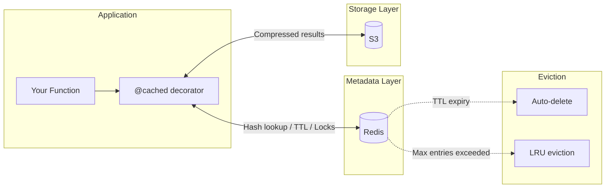
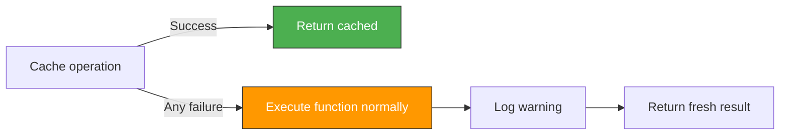
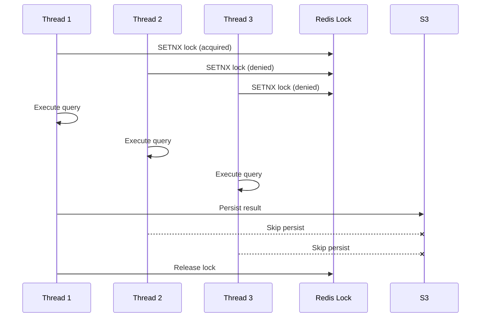

# s3cache

A Python decorator-based caching library that stores query results in **S3** with **Redis** as the metadata layer. Add one decorator to any function — repeated calls with the same arguments return cached results from S3 instead of hitting your database.


## Architecture



## Quickstart

```python
from s3cache import CacheManager, cached

CacheManager.initialize(
    s3_bucket="my-cache-bucket",
    redis_url="redis://localhost:6379/0",
)

@cached(ttl=3600, namespace="analytics")
def run_query(query: str):
    return db.execute(query)  # only runs on cache miss

result = run_query("SELECT * FROM users WHERE active = true")
```

## Key Features

### Fail-Open Design
Every cache operation is wrapped in try/except. If Redis is down, S3 fails, or serialization breaks — the original function executes normally. The cache layer is invisible on failure.



### Stampede Protection
When a cold query is hit by multiple threads simultaneously, only one thread persists the result to cache. Others execute the function but skip the write, preventing redundant S3 uploads.



### Smart Serialization
Format is auto-detected based on the return type:

| Return Type | Format | Compression |
|---|---|---|
| `pandas.DataFrame` | Parquet (via PyArrow) | Zstandard |
| Everything else | Pickle | Zstandard |

Override with `format="json"` or `format="pickle"` in the decorator, and `compression="gzip"` or `compression="none"` in config.

### Async Persistence
After a cache miss, the result is returned to the caller **immediately**. Serialization, compression, S3 upload, and Redis metadata write all happen in a background daemon thread. Zero added latency on cache misses.

### Cache Key Generation
Cache keys are generated via SHA-256 hash of the normalized input + serialized arguments. Normalization:
- Strip leading/trailing whitespace
- Collapse multiple whitespace to single space
- Case-sensitive (no lowercasing — your input, your key)

```
"SELECT  *  FROM  Users" → same hash as → "SELECT * FROM Users"  (whitespace only)
"select * from Users"    → different hash (case matters)
"get_user_profile"       → works with any string, not just SQL
```

### Eviction Strategies

| Strategy | How |
|---|---|
| **TTL** | Redis `EXPIRE` — automatic, no cleanup jobs needed |
| **LRU** | When `max_cache_entries` exceeded, oldest entries by `created_at` are evicted |
| **Manual** | `mgr.invalidate(hash)`, `mgr.invalidate_namespace(ns)`, `mgr.clear()` |
| **Orphan cleanup** | `mgr.cleanup_orphaned_objects()` — deletes S3 objects with no Redis key |

## Configuration

| Parameter | Default | Description |
|---|---|---|
| `s3_bucket` | required | S3 bucket name |
| `s3_prefix` | `"query-cache"` | S3 key prefix |
| `redis_url` | `"redis://localhost:6379/0"` | Redis connection URL |
| `redis_key_prefix` | `"qc:"` | Redis key prefix |
| `default_ttl` | `3600` | Default TTL in seconds |
| `serialization_format` | `"auto"` | `"auto"` / `"parquet"` / `"pickle"` / `"json"` |
| `compression` | `"zstd"` | `"zstd"` / `"gzip"` / `"none"` |
| `max_cache_entries` | `10000` | Max entries before LRU eviction |
| `stampede_lock_ttl` | `30` | Stampede lock timeout in seconds |
| `storage_backend` | `"s3"` | `"s3"` / `"local"` |
| `local_path` | `"/tmp/query_cache"` | Path for local storage backend |
| `aws_region` | `"us-east-1"` | AWS region |

## Observability

```python
mgr = CacheManager.get()
print(mgr.stats())
# {
#     "hits": 1234,
#     "misses": 56,
#     "errors": 2,
#     "hit_rate": 0.956,
#     "avg_hit_latency_ms": 12.3,
#     "avg_miss_latency_ms": 4500.0
# }
```

## Tech Stack

| Component | Technology |
|---|---|
| Language | Python >=3.9 |
| Metadata store | Redis (HASH + EXPIRE + SETNX) |
| Result store | AWS S3 (AES-256 server-side encryption) |
| Serialization | Pickle, Apache Parquet (PyArrow) |
| Compression | Zstandard, Gzip |
| AWS SDK | boto3 |
| Type checking | mypy (strict) |
| Linting | ruff |
| Testing | pytest, fakeredis, 84% coverage |
| CI | GitHub Actions (Python 3.10 / 3.11 / 3.12) |

## Dev Setup

```bash
# Start Redis
docker run -d -p 6379:6379 redis:7-alpine

# Install
pip install -e ".[dev]"

# Run tests
pytest

# Lint + type check
ruff check src/ tests/
mypy src/s3cache/
```

## Project Structure

```
src/s3cache/
├── __init__.py          # Public API
├── decorator.py         # @cached() decorator
├── manager.py           # CacheManager singleton, stats, eviction
├── key.py               # Query normalization + SHA-256 hashing
├── serializer.py        # Smart serialization + compression
└── storage/
    ├── base.py          # StorageBackend ABC
    ├── local.py         # LocalDiskBackend (dev/testing)
    └── s3.py            # S3Backend (production)
```
